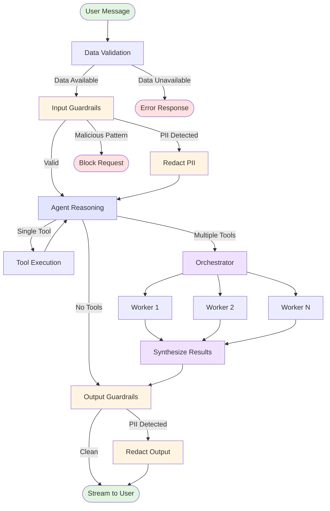

# Fitness Analysis Application

A fitness analysis application that uses LangGraph and Google's Gemini LLM to analyze Garmin and MyFitnessPal data.

## Features

- **LangGraph Agent**: Intelligent agent with comprehensive guardrails
  - **Data Validation**: Verifies fitness data is loaded before processing
  - **PII Detection & Redaction**: Automatically detects and redacts emails, phone numbers, SSNs, credit cards, and API keys
  - **Input Validation**: Blocks malicious patterns and prompt injection attempts
  - **Output Validation**: Ensures no sensitive information leaks in responses
- **Multi-Tool Synthesis**: Uses orchestrator-worker pattern when multiple tools are called
- **Multiple Tools**:
  - Fitness data analysis (Garmin + MyFitnessPal)
  - TDEE and macro calculator
  - Recipe search with detailed results from BBC Food
  - Mermaid diagram generator for visualizations
- **Real-time Streaming**: WebSocket-based communication for streaming responses
- **Comprehensive Analysis**: Analyze nutrition, exercise, and activity data
- **Modern UI**: UIkit CSS-based SvelteKit frontend with real-time chat interface

## Project Structure

```
backend/
├── src/
│   └── fitness_analysis/
│       ├── agent.py          # LangGraph agent with guardrails
│       ├── tools.py          # Tool definitions
│       ├── data_loader.py    # Data loading utilities
│       └── main.py           # FastAPI application
├── pyproject.toml
└── .env.example

frontend/
├── src/
│   └── routes/
│       ├── +page.svelte      # Chat interface
│       └── chat.css          # Styles
└── package.json

start.sh                        # Startup script
stop.sh                         # Teardown script
```

## Quick Start

### Prerequisites

- Python 3.12+
- Node.js 18+
- Gemini API key from https://makersuite.google.com/app/apikey

### Setup

1. **Install backend dependencies:**
```bash
cd backend
uv pip install -e .
```

2. **Configure environment:**
```bash
cd backend
cp .env.example .env
# Edit .env and add your GEMINI_TOKEN
```

3. **Install frontend dependencies:**
```bash
cd frontend
npm install
```

### Running the Application

**Start everything:**
```bash
./start.sh
```

**Stop everything:**
```bash
./stop.sh
```

The application will be available at:
- Backend: http://localhost:8000
- Frontend: http://localhost:5173

### Manual Start (Alternative)

**Backend:**
```bash
cd backend
python -m fitness_analysis.main
```

**Frontend:**
```bash
cd frontend
npm run dev
```

## Usage

1. Start the application using `./start.sh`
2. Open http://localhost:5173 in your browser
3. Ask questions about your fitness data:
   - "What are my ideal macros based on my data?"
   - "How many calories am I burning in my workouts?"
   - "What's my average protein intake?"
   - "Find me healthy high-protein recipes"

## Configuration

### Environment Variables

You can provide the Gemini API token in two ways:

**Option 1: Environment Variable (Recommended)**
```bash
export GEMINI_TOKEN=your_gemini_api_key_here
```

**Option 2: .env File**
```bash
cd backend
cp .env.example .env
# Edit .env and add your GEMINI_TOKEN
```

The application will check for the environment variable first, then fall back to the `.env` file.

### Data Format

The application expects CSV files in:

- **Garmin Data**: `/home/$USER/projects/data/garmin/garmin.csv`
- **MFP Nutrition**: `/home/$USER/projects/data/mfp/Nutrition-Summary-*.csv`
- **MFP Exercise**: `/home/$USER/projects/data/mfp/Exercise-Summary-*.csv`
- **MFP Measurements**: `/home/$USER/projects/data/mfp/Measurement-Summary-*.csv`

## Technologies

- **Backend**: FastAPI, LangGraph, LangChain, Google Gemini 2.5 Flash, Pandas, BeautifulSoup4
- **Frontend**: SvelteKit, TypeScript, WebSockets, UIkit CSS
- **AI**: LangGraph for agent orchestration with multi-layer guardrails

## Architecture

The application uses an enhanced LangGraph agent with multiple safety layers:

### Agent Flow Diagram



### Guardrails

1. **Data Validation Node**: Verifies fitness data is accessible before processing
   - Attempts to load data on first request
   - Returns error if data unavailable
   - Prevents hallucinations about non-existent data

2. **Input Guardrails**: 
   - **PII Detection**: Scans for emails, phone numbers, SSNs, credit cards, API keys
   - **PII Redaction**: Automatically redacts detected PII with `[REDACTED_TYPE]` placeholders
   - **Prompt Injection Protection**: Blocks malicious patterns like "ignore previous instructions"
   - **Length Validation**: Enforces 2000 character limit

3. **Output Guardrails**:
   - **PII Scanning**: Ensures no PII leaks in agent responses
   - **Sensitive Data Check**: Blocks passwords, tokens, and private keys
   - **Automatic Redaction**: Redacts any detected sensitive information

### Multi-Tool Synthesis

When the agent needs to call multiple tools (e.g., get nutrition data AND calculate TDEE):

1. **Orchestrator**: Agent identifies multiple tools needed
2. **Workers**: Each tool executes independently 
3. **Synthesizer**: Combines all tool results into a coherent response using Gemini

This ensures comprehensive answers when queries require multiple data sources.

### Agent Flow

```
START → Data Validation → Input Guard → Agent → [Tools/Synthesize] → Output Guard → END
                                          ↑____________↓
```

The agent maintains conversation context through LangGraph's MemorySaver checkpointer.

## Logs

View logs in real-time:
```bash
tail -f backend.log
tail -f frontend.log
```

